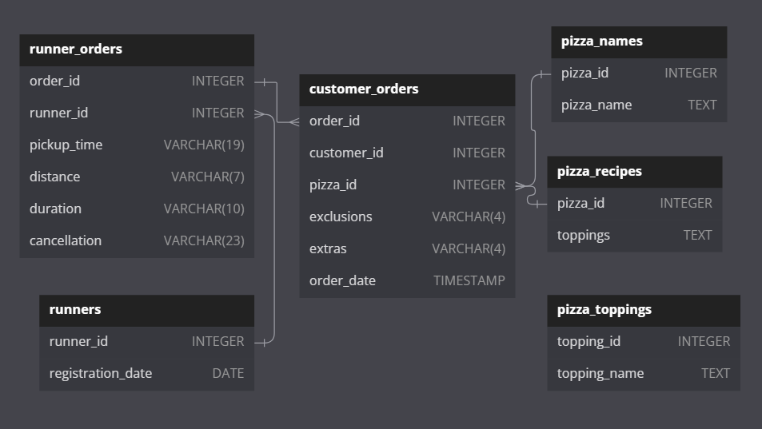

# 🍕 Case Study #1 - Pizza Runner
- https://8weeksqlchallenge.com/case-study-2/
<p align="center">


## 📂 Dataset
Danny has shared with you 6 key datasets for this case study:

### **```runners```**
<details>
<summary>
View table
</summary>

The runners table shows the **```registration_date```** for each new runner.


|runner_id|registration_date|
|---------|-----------------|
|1        |1/1/2021         |
|2        |1/3/2021         |
|3        |1/8/2021         |
|4        |1/15/2021        |


</details>


### **```customer_orders```**

<details>
<summary>
View table
</summary>

Customer pizza orders are captured in the **```customer_orders```** table with 1 row for each individual pizza that is part of the order.

|order_id|customer_id|pizza_id|exclusions|extras|order_time          |
|--------|-----------|--------|----------|------|---------------------|
|1       |101        |1       |          |      |2021-01-01 18:05:02  |
|2       |101        |1       |          |      |2021-01-01 19:00:52  |
|3       |102        |1       |          |      |2021-01-02 23:51:23  |
|3       |102        |2       |          |NaN   |2021-01-02 23:51:23  |
|4       |103        |1       |4         |      |2021-01-04 13:23:46  |
|4       |103        |1       |4         |      |2021-01-04 13:23:46  |
|4       |103        |2       |4         |      |2021-01-04 13:23:46  |
|5       |104        |1       |null      |1     |2021-01-08 21:00:29  |
|6       |101        |2       |null      |null  |2021-01-08 21:03:13  |
|7       |105        |2       |null      |1     |2021-01-08 21:20:29  |
|8       |102        |1       |null      |null  |2021-01-09 23:54:33  |
|9       |103        |1       |4         |1, 5  |2021-01-10 11:22:59  |
|10      |104        |1       |null      |null  |2021-01-11 18:34:49  |
|10      |104        |1       |2, 6      |1, 4  |2021-01-11 18:34:49  |


</details>

### **```runner_orders```**

<details>
<summary>
View table
</summary>

After each orders are received through the system - they are assigned to a runner - however not all orders are fully completed and can be cancelled by the restaurant or the customer.

The **```pickup_time```** is the timestamp at which the runner arrives at the Pizza Runner headquarters to pick up the freshly cooked pizzas. 

The **```distance```** and **```duration```** fields are related to how far and long the runner had to travel to deliver the order to the respective customer.


|order_id|runner_id|pickup_time          |distance|duration   |cancellation             |
|--------|---------|---------------------|--------|-----------|-------------------------|
|1       |1        |2021-01-01 18:15:34  |20km    |32 minutes |                         |
|2       |1        |2021-01-01 19:10:54  |20km    |27 minutes |                         |
|3       |1        |2021-01-03 00:12:37  |13.4km  |20 mins    |NaN                      |
|4       |2        |2021-01-04 13:53:03  |23.4    |40         |NaN                      |
|5       |3        |2021-01-08 21:10:57  |10      |15         |NaN                      |
|6       |3        |null                 |null    |null       |Restaurant Cancellation  |
|7       |2        |2020-01-08 21:30:45  |25km    |25mins     |null                     |
|8       |2        |2020-01-10 00:15:02  |23.4 km |15 minute  |null                     |
|9       |2        |null                 |null    |null       |Customer Cancellation    |
|10      |1        |2020-01-11 18:50:20  |10km    |10minutes  |null                     |


</details>

### **```pizza_names```**

<details>
<summary>
View table
</summary>

|pizza_id|pizza_name   |
|--------|-------------|
|1       |Meat Lovers  |
|2       |Vegetarian   |


</details>

### **```pizza_recipes```**

<details>
<summary>
View table
</summary>

Each **```pizza_id```** has a standard set of **```toppings```** which are used as part of the pizza recipe.


|pizza_id|toppings                 |
|--------|-------------------------|
|1       |1, 2, 3, 4, 5, 6, 8, 10  |
|2       |4, 6, 7, 9, 11, 12       |


</details>

### **```pizza_toppings```**

<details>
<summary>
View table
</summary>

This table contains all of the **```topping_name```** values with their corresponding **```topping_id```** value.


|topping_id|topping_name|
|----------|------------|
|1         |Bacon       |
|2         |BBQ Sauce   |
|3         |Beef        |
|4         |Cheese      |
|5         |Chicken     |
|6         |Mushrooms   |
|7         |Onions      |
|8         |Pepperoni   |
|9         |Peppers     |
|10        |Salami      |
|11        |Tomatoes    |
|12        |Tomato Sauce|


</details>

<details>
<summary>
View Entity Relationship Diagram
</summary>
  <p align="center">
</p>
</details>

---

## ♻️ Data Cleaning
[](https://github.com/LNYN-1508/data-exploration-with-SQL/blob/main/pizza_runners_exploration_pgsql/creata_table_and_cleaning.sql)

<details>
<summary>
Create table
</summary>
  
- This is the raw data
  
** **
    CREATE TABLE runners (
      "runner_id" INTEGER,
      "registration_date" DATE
    );
    
    INSERT INTO runners
      ("runner_id", "registration_date")
    VALUES
      (1, '2021-01-01'),
      (2, '2021-01-03'),
      (3, '2021-01-08'),
      (4, '2021-01-15');
    
    CREATE TABLE customer_orders (
      "order_id" INTEGER,
      "customer_id" INTEGER,
      "pizza_id" INTEGER,
      "exclusions" VARCHAR(4),
      "extras" VARCHAR(4),
      "order_time" TIMESTAMP
    );
    
    INSERT INTO customer_orders
      ("order_id", "customer_id", "pizza_id", "exclusions", "extras", "order_time")
    VALUES
      ('1', '101', '1', '', '', '2020-01-01 18:05:02'),
      ('2', '101', '1', '', '', '2020-01-01 19:00:52'),
      ('3', '102', '1', '', '', '2020-01-02 23:51:23'),
      ('3', '102', '2', '', NULL, '2020-01-02 23:51:23'),
      ('4', '103', '1', '4', '', '2020-01-04 13:23:46'),
      ('4', '103', '1', '4', '', '2020-01-04 13:23:46'),
      ('4', '103', '2', '4', '', '2020-01-04 13:23:46'),
      ('5', '104', '1', 'null', '1', '2020-01-08 21:00:29'),
      ('6', '101', '2', 'null', 'null', '2020-01-08 21:03:13'),
      ('7', '105', '2', 'null', '1', '2020-01-08 21:20:29'),
      ('8', '102', '1', 'null', 'null', '2020-01-09 23:54:33'),
      ('9', '103', '1', '4', '1, 5', '2020-01-10 11:22:59'),
      ('10', '104', '1', 'null', 'null', '2020-01-11 18:34:49'),
      ('10', '104', '1', '2, 6', '1, 4', '2020-01-11 18:34:49');
    
    
    CREATE TABLE runner_orders (
      "order_id" INTEGER,
      "runner_id" INTEGER,
      "pickup_time" VARCHAR(19),
      "distance" VARCHAR(7),
      "duration" VARCHAR(10),
      "cancellation" VARCHAR(23)
    );
    
    INSERT INTO runner_orders
      ("order_id", "runner_id", "pickup_time", "distance", "duration", "cancellation")
    VALUES
      ('1', '1', '2020-01-01 18:15:34', '20km', '32 minutes', ''),
      ('2', '1', '2020-01-01 19:10:54', '20km', '27 minutes', ''),
      ('3', '1', '2020-01-03 00:12:37', '13.4km', '20 mins', NULL),
      ('4', '2', '2020-01-04 13:53:03', '23.4', '40', NULL),
      ('5', '3', '2020-01-08 21:10:57', '10', '15', NULL),
      ('6', '3', 'null', 'null', 'null', 'Restaurant Cancellation'),
      ('7', '2', '2020-01-08 21:30:45', '25km', '25mins', 'null'),
      ('8', '2', '2020-01-10 00:15:02', '23.4 km', '15 minute', 'null'),
      ('9', '2', 'null', 'null', 'null', 'Customer Cancellation'),
      ('10', '1', '2020-01-11 18:50:20', '10km', '10minutes', 'null');
    
    
    CREATE TABLE pizza_names (
      "pizza_id" INTEGER,
      "pizza_name" TEXT
    );
    INSERT INTO pizza_names
      ("pizza_id", "pizza_name")
    VALUES
      (1, 'Meatlovers'),
      (2, 'Vegetarian');
    
    
    CREATE TABLE pizza_recipes (
      "pizza_id" INTEGER,
      "toppings" TEXT
    );
    INSERT INTO pizza_recipes
      ("pizza_id", "toppings")
    VALUES
      (1, '1, 2, 3, 4, 5, 6, 8, 10'),
      (2, '4, 6, 7, 9, 11, 12');
    
    
    CREATE TABLE pizza_toppings (
      "topping_id" INTEGER,
      "topping_name" TEXT
    );
    INSERT INTO pizza_toppings
      ("topping_id", "topping_name")
    VALUES
      (1, 'Bacon'),
      (2, 'BBQ Sauce'),
      (3, 'Beef'),
      (4, 'Cheese'),
      (5, 'Chicken'),
      (6, 'Mushrooms'),
      (7, 'Onions'),
      (8, 'Pepperoni'),
      (9, 'Peppers'),
      (10, 'Salami'),
      (11, 'Tomatoes'),
      (12, 'Tomato Sauce');

</details>

<details>
<summary>
Cleaning data
</summary>
  
## Clean customer_orders data:

- With this table, the only dirty elements are the inappropriate 'null' values. Therefore, I will replace all of them

** ** 
    SELECT * FROM customer_orders
    WHERE exclusions LIKE '%null%' OR exclusions LIKE '%nan' OR exclusions = '';
    
    UPDATE customer_orders
    SET exclusions = 
    	(CASE WHEN exclusions LIKE '%null%' 
    	 		OR exclusions LIKE '%nan' 
    	 		OR exclusions = '' THEN NULL ELSE exclusions END
    	);
    
    UPDATE customer_orders
    SET extras = CASE WHEN extras = '' OR extras LIKE '%null%' THEN NULL ELSE extras END;

### Before

|order_id|customer_id|pizza_id|exclusions|extras|order_time          |
|--------|-----------|--------|----------|------|---------------------|
|1       |101        |1       |          |      |2021-01-01 18:05:02  |
|2       |101        |1       |          |      |2021-01-01 19:00:52  |
|3       |102        |1       |          |      |2021-01-02 23:51:23  |
|3       |102        |2       |          |NaN   |2021-01-02 23:51:23  |
|4       |103        |1       |4         |      |2021-01-04 13:23:46  |
|4       |103        |1       |4         |      |2021-01-04 13:23:46  |
|4       |103        |2       |4         |      |2021-01-04 13:23:46  |
|5       |104        |1       |null      |1     |2021-01-08 21:00:29  |
|6       |101        |2       |null      |null  |2021-01-08 21:03:13  |
|7       |105        |2       |null      |1     |2021-01-08 21:20:29  |
|8       |102        |1       |null      |null  |2021-01-09 23:54:33  |
|9       |103        |1       |4         |1, 5  |2021-01-10 11:22:59  |
|10      |104        |1       |null      |null  |2021-01-11 18:34:49  |
|10      |104        |1       |2, 6      |1, 4  |2021-01-11 18:34:49  |

### After
|order_id|customer_id|pizza_id|exclusions|extras|order_time          |
|--------|-----------|--------|----------|------|--------------------|
|1       |101        |1       |          |      |2020-01-01 18:05:02 |
|2       |101        |1       |          |      |2020-01-01 19:00:52 |
|3       |102        |1       |          |      |2020-01-02 23:51:23 |
|3       |102        |2       |          |      |2020-01-02 23:51:23 |
|4       |103        |1       |4         |      |2020-01-04 13:23:46 |
|4       |103        |1       |4         |      |2020-01-04 13:23:46 |
|4       |103        |2       |4         |      |2020-01-04 13:23:46 |
|5       |104        |1       |          |1     |2020-01-08 21:00:29 |
|6       |101        |2       |          |      |2020-01-08 21:03:13 |
|7       |105        |2       |          |1     |2020-01-08 21:20:29 |
|8       |102        |1       |          |      |2020-01-09 23:54:33 |
|9       |103        |1       |4         |1, 5  |2020-01-10 11:22:59 |
|10      |104        |1       |          |      |2020-01-11 18:34:49 |
|10      |104        |1       |2, 6      |1, 4  |2020-01-11 18:34:49 |


</details>
